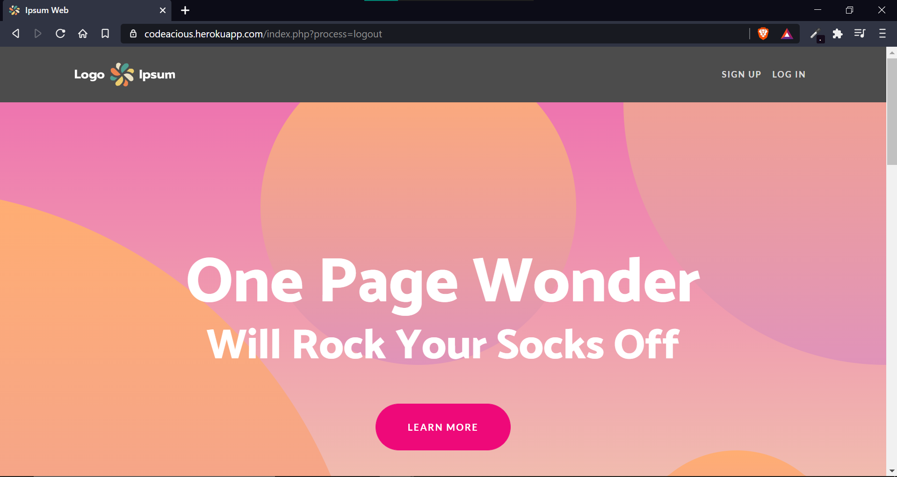
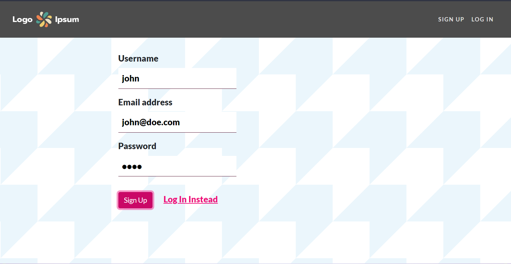
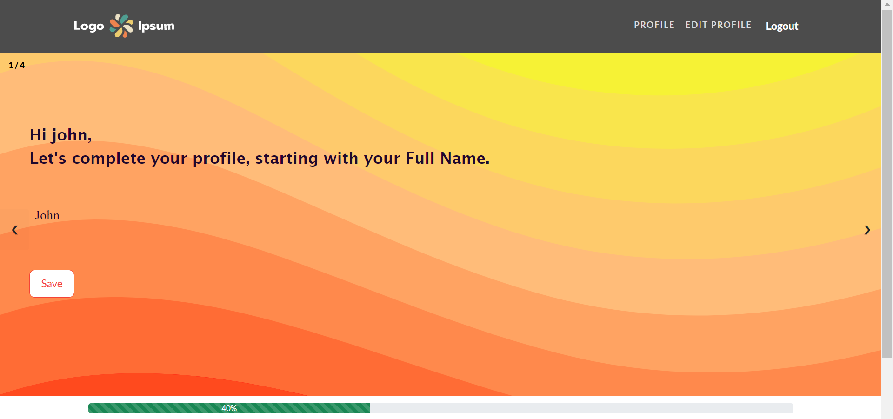
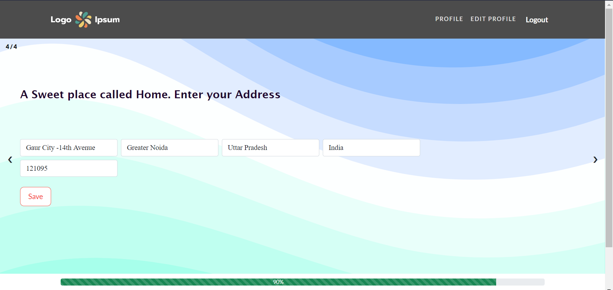
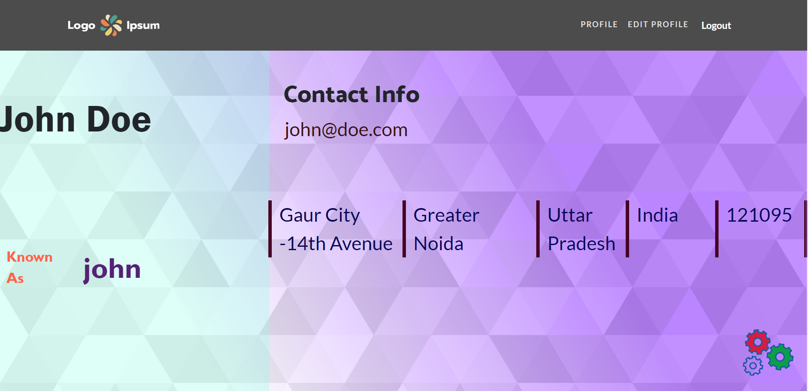
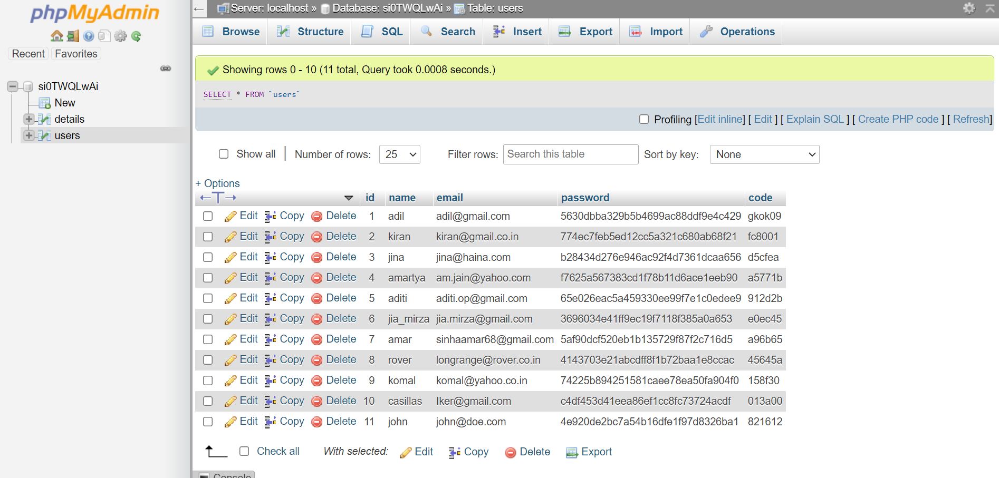
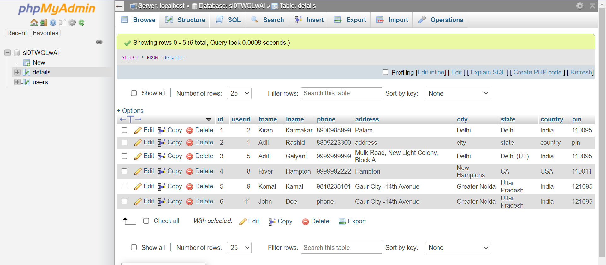

# Codeacious Task
    Build a PHP application using MVC pattern with following features:
- Allow a user to create an account with following profile information: "Name", "Email", "Password", "Phone", "Address", "City", "State", "Country", "ZIP"
- Use appropriate validation of the user input values and prompt the user accordingly.
- After creating the account, users should be able to login/logout to the application.
- After login, display the profile details of the logged in user.

---

## My details 
    Name : Amar Sinha
    Contact : +91 958 2289 249
    Email : sinhaamar68@gmail.com

---
## Live Prototype Available 

### [Link To Web App](https://codeacious.herokuapp.com/)
    Note: Web App is hosted on a free hosting platform, it can take time to load. 
     
---
## Steps To Run the Project 
- For Hosting over at Localhost, firstly clone the github repository [Project Repository](https://github.com/web-advisor/Codeacious) or simply download the Zip file from github.
- Make sure the Cloned or Downloaded folder is in the right place in accordance with the requirements of the local host package. For instance, to run localhost with Apache server using XAMPP, the cloned or downloaded folder should be placed in the htdocs folder.
- Open localhost databse service provider like phpmyadmin, surf over to Import Database Section and click on Import from device, Select SQL FILE provided [assets/database/codeacious.sql]() 
- Open File [hash.php]() available in [control/hash.php](). Inside this file, Local Database and Remote Database Credentials are provided. Uncomment favored Credentials type. Change [Local Database Credentials]() according to your localhost credentials. Enter the value of string variables [$userName](), [$password]() to connect your localhost to the web app.
- [hash.php]() also contains commented out credentials for some sample users stored in the provided database
- Project should be ready to Explore after the above mentioned steps at [http://localhost/codeacious/](http://localhost/codeacious/)

---
## Web App Flow 
---
### Home Page : 

### Sign Up or Log In initiation :

### Profile Set up : 
    Logged In Users are prompted to complete their profile setup.

### Profile View 

---
### Glimpse of Database :

---

### Project Highlights : 
- Web App doesn't prompt for a lot of information during the Sign Up thus giving user the space and thus a favored UI.
- Password is Hashed, and not stored as it is in the database thus even after database attack, sensitive information is not  lost.
- Database Architecture is also efficient.
- Username is check for it is already taken suring typing at sign up time, thus maintaining unique identities via username.
- MVC structure is efficiently applied. Model and View doesn't interact directly, they are always applied via the Controller part.
- CSS id's and class' are named in an explaining trend, thus giving opportunity for dynamic javascript functionalities.
- Loading Page is also handled to give smoother UI.

### Comments : 
- In the Profile Editing Section, there is a prompt to verify Email entered by the User, for which I have used mail() function. I did set up localhost SMTP with my Google Account but Google Account notified that it no longer allows third party to access and send emails from, since they have lesser security standards, thus I applied a temporary solution to feed the OTP CODE inside of a $_SESSION varible and provide the user directly in the input field, just for Development Purpose.

---
---